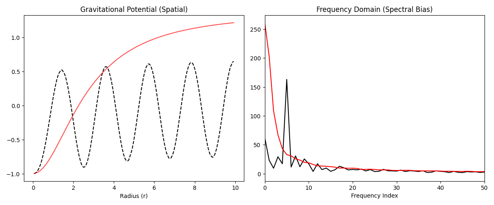

# PINN Gravitational Potential Benchmarking Project

In this project, I aim to compare PINN approach against other numerical and analytical techniques in modeling gravitational potential.

## Directory Structure
- `/code/pinn_code/`: Includes the main files for training and benchmarking PINN models (`main.py (The First Train File)`,`retrain.py`, `benchmark.py`).
- `/code/pinn_code/MODELS/`: Model checkpoints are stored here.
- `benchmark_results.csv`: Benchmarking results are recorded.

## Instructions
1. Clone this repository.
2. Make a virtual environment and activate it.
3. Install dependencies using:
   pip install -r requirements.txt

## Results

## Citation
If you use this code for your research, please cite:
"Benchmarking Physics-Informed Neural Networks for Gravitational Potential Modeling," Sachin S. (2026).

